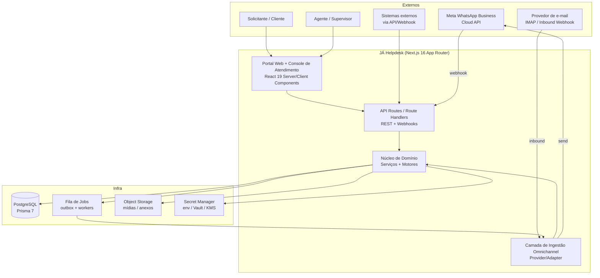
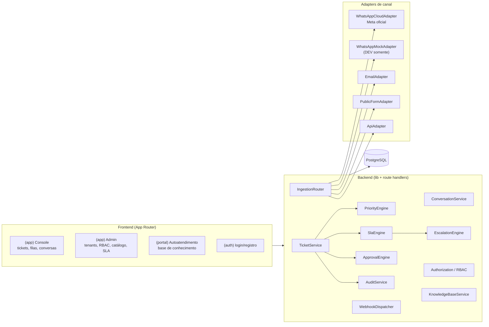
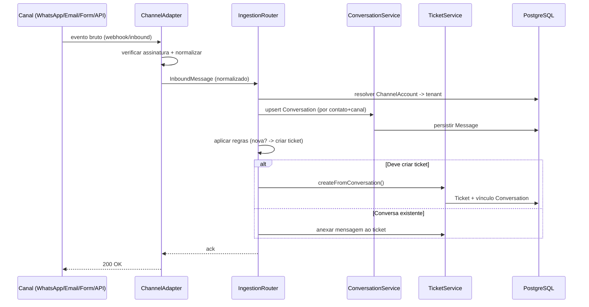
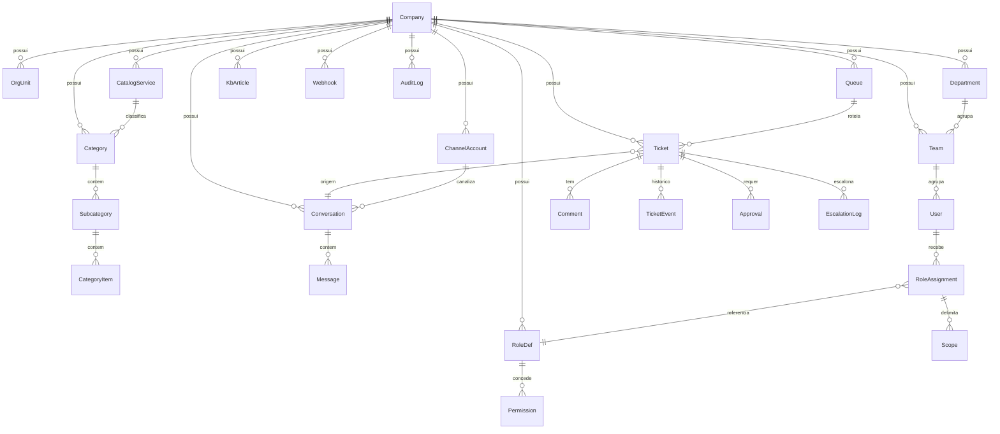
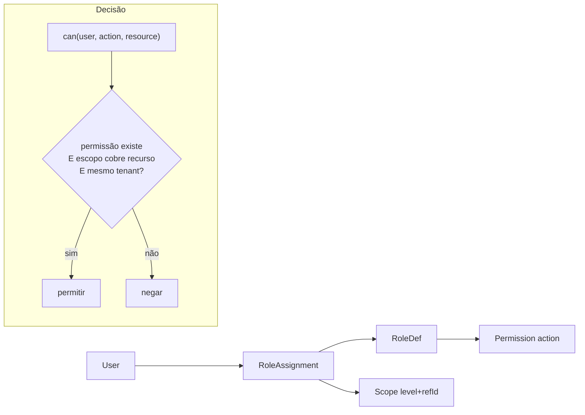
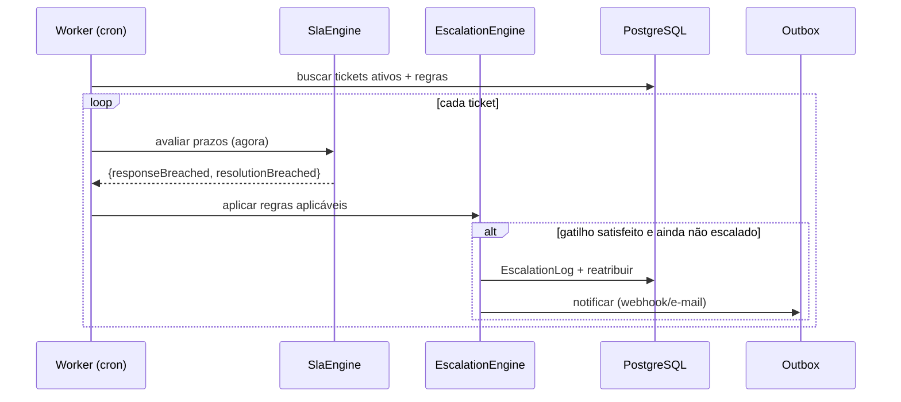
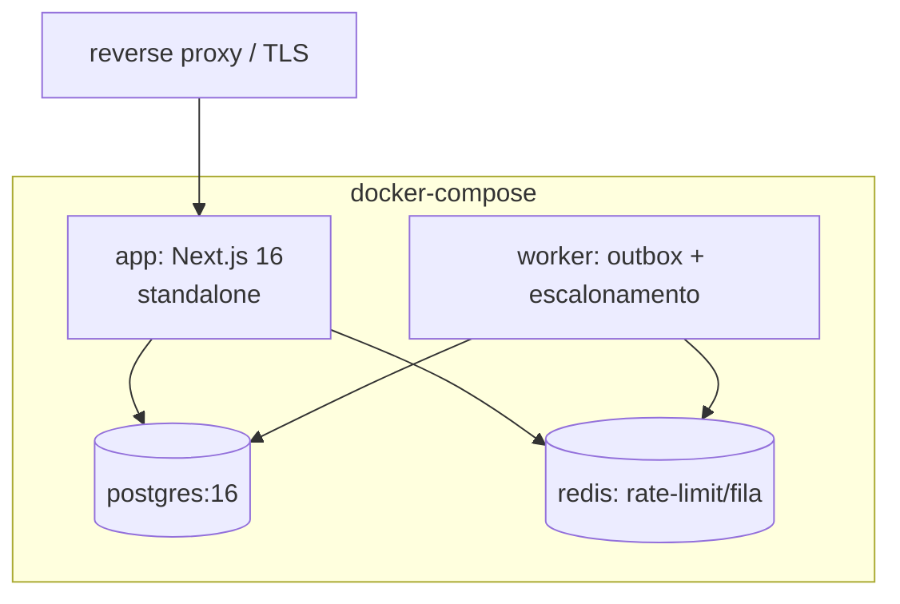

# Documento de Design: JÁ Helpdesk — Plataforma Omnichannel

## Overview

*Visão Geral*

O **JÁ Helpdesk** é uma plataforma de atendimento omnichannel corporativa, projetada para operar tanto como **SaaS multi-tenant** quanto em **instalação on-premises** via Docker Compose, com arquitetura preparada (mas não dependente) de Kubernetes. O sistema centraliza solicitações recebidas por portal web, WhatsApp Business Platform (Cloud API oficial da Meta), e-mail, formulário público, API e integrações futuras, convertendo-as em conversas e/ou tickets rastreáveis com SLA, prioridades, escalonamentos, aprovações e histórico auditável.

Este design **estende** a base de código existente (Next.js 16.2.6 App Router, React 19, TypeScript 5, Prisma 7 + PostgreSQL, NextAuth v5, Zod v4, Tailwind v4, nodemailer/resend, bcryptjs) — não a substitui. Os modelos atuais `Company`, `User`, `Ticket`, `Comment`, `SlaRule` e `PasswordResetToken` são preservados e evoluídos; a coluna `companyId` já presente na sessão JWT do NextAuth passa a ser o eixo de isolamento de tenant em todas as consultas.

A camada de ingestão omnichannel adota **padrão provider/adapter**: cada canal (WhatsApp, e-mail, formulário público, API) implementa uma interface comum. Para o WhatsApp entregamos um **adaptador funcional da Cloud API oficial** e um **provider MOCK claramente identificado** para desenvolvimento local — ambos compartilham a mesma interface, permitindo trocar por variável de ambiente. **É proibido** automação de navegador, WhatsApp Web, QR Code, scraping ou bibliotecas não oficiais.

> Nota: Steering files e ADRs (Architecture Decision Records) serão criados em fases posteriores. Este documento consolida a arquitetura de referência e as assinaturas de baixo nível.

---

## Architecture

*Arquitetura de Alto Nível*

### Diagrama de contexto (C4 — nível 1)



### Diagrama de contêineres e módulos



### Princípios arquiteturais

1. **Isolamento de tenant por padrão (defense in depth):** toda entidade de negócio carrega `companyId`; toda consulta é filtrada por `companyId` derivado da sessão/servidor — nunca do corpo da requisição do cliente. Autorização é aplicada **no backend**; esconder botões no frontend **não** é controle de acesso.
2. **Núcleo puro, efeitos nas bordas:** motores (prioridade, SLA, escalonamento) são funções puras e testáveis; I/O (DB, HTTP, filas) fica isolado em serviços/adapters.
3. **Provider/Adapter para canais:** um único `ChannelAdapter` unifica envio/recebimento; mock e real são intercambiáveis por env.
4. **Outbox transacional:** mudanças de estado e efeitos externos (enviar WhatsApp, disparar webhook) são gravados na mesma transação e processados por workers idempotentes.
5. **Auditabilidade e LGPD por construção:** toda operação sensível gera registro de auditoria imutável; dados pessoais têm base legal, retenção e trilha de acesso.

---

## Components and Interfaces

*Componentes e Interfaces*

> As interfaces e assinaturas de baixo nível (TypeScript) que complementam os componentes descritos aqui estão detalhadas na seção **Design de Baixo Nível** (interfaces centrais, tipos e assinaturas de serviço).

### Camada de Ingestão Omnichannel

O `IngestionRouter` recebe eventos normalizados de qualquer canal (`InboundMessage`) e decide se cria/atualiza uma **conversa** e se abre/atualiza um **ticket**, aplicando regras de roteamento (fila, categoria, tenant).



**Componentes:**

| Componente | Responsabilidade |
|---|---|
| `ChannelAdapter` (interface) | Contrato comum: verificar assinatura, normalizar entrada, enviar saída, capacidades. |
| `WhatsAppCloudAdapter` | Integração real com a **Meta WhatsApp Business Cloud API** (webhooks, envio, mídia, templates, janela 24h). |
| `WhatsAppMockAdapter` | Provider de DEV que implementa a mesma interface, sem chamadas externas. **Nunca** habilitado em produção. |
| `EmailAdapter` | Ingestão por e-mail (inbound webhook do Resend ou IMAP via nodemailer); envio de respostas. |
| `PublicFormAdapter` | Recebe submissões de formulário público seguro (rate limit, captcha, antispam). |
| `ApiAdapter` | Cria/atualiza tickets via API autenticada (integration/service accounts). |
| `IngestionRouter` | Normalização → roteamento → conversa/ticket. |

### Console de Atendimento e Portal (Frontend)

Estende `src/app/(app)/` com novas rotas (`conversations`, `queues`, `catalog`, `knowledge`, `admin/rbac`, `admin/channels`) e adiciona um grupo `(portal)` de autoatendimento. Server Components para leitura filtrada por tenant; Client Components para formulários (react-hook-form + Zod).

---

## Data Models

*Modelo de Dados — extensão do schema Prisma existente*

O schema abaixo **estende** o atual. Modelos existentes (`Company`, `User`, `Ticket`, `Comment`, `SlaRule`, `PasswordResetToken`) são mantidos e ampliados; `Company` passa a ser o **tenant raiz**. Novos enums e modelos são adicionados. Chaves estrangeiras sempre incluem `companyId` para reforçar isolamento.

### Diagrama entidade-relacionamento (visão macro)



### Enums (novos e ampliados)

```prisma
// Ampliar Role existente para papéis granulares corporativos
enum Role {
  SUPERADMIN        // Superadmin de plataforma
  ADMIN             // Admin do tenant
  SERVICE_MANAGER   // Gestor de serviço
  SUPERVISOR
  AGENT
  SPECIALIST        // L2/L3
  APPROVER
  AUDITOR
  READONLY
  INTEGRATION       // conta de integração (API)
  SERVICE_ACCOUNT   // conta de serviço (automações)
  CLIENT            // solicitante
}

enum TicketStatus {
  OPEN
  IN_PROGRESS
  WAITING
  PENDING_APPROVAL
  RESOLVED
  CLOSED
  CANCELLED
}

enum Priority { LOW  MEDIUM  HIGH  CRITICAL }
enum Impact   { LOW  MEDIUM  HIGH }
enum Urgency  { LOW  MEDIUM  HIGH }

enum ChannelType { WEB  WHATSAPP  EMAIL  PUBLIC_FORM  API }
enum ChannelProvider { WHATSAPP_CLOUD  WHATSAPP_MOCK  EMAIL_RESEND  EMAIL_IMAP  INTERNAL }

enum MessageDirection { INBOUND  OUTBOUND }
enum MessageType { TEXT  IMAGE  DOCUMENT  AUDIO  VIDEO  TEMPLATE  SYSTEM }
enum ConversationState { OPEN  PENDING  RESOLVED  EXPIRED }

enum ApprovalState { PENDING  APPROVED  REJECTED  CANCELLED }
enum EscalationTrigger { RESPONSE_BREACH  RESOLUTION_BREACH  INACTIVITY  MANUAL }
enum OutboxState { PENDING  PROCESSING  SENT  FAILED }
enum ScopeLevel { TENANT  UNIT  DEPARTMENT  TEAM  QUEUE  CATEGORY  TICKET }
```

### Modelos de organização e catálogo

```prisma
model OrgUnit {
  id        String   @id @default(cuid())
  companyId String
  name      String
  parentId  String?
  company   Company  @relation(fields: [companyId], references: [id])
  parent    OrgUnit? @relation("UnitTree", fields: [parentId], references: [id])
  children  OrgUnit[] @relation("UnitTree")
  @@index([companyId])
}

model Department {
  id        String  @id @default(cuid())
  companyId String
  unitId    String?
  name      String
  company   Company @relation(fields: [companyId], references: [id])
  teams     Team[]
  @@index([companyId])
}

model Team {
  id           String     @id @default(cuid())
  companyId    String
  departmentId String?
  name         String
  members      TeamMember[]
  company      Company    @relation(fields: [companyId], references: [id])
  @@index([companyId])
}

model TeamMember {
  id      String @id @default(cuid())
  teamId  String
  userId  String
  team    Team   @relation(fields: [teamId], references: [id])
  user    User   @relation(fields: [userId], references: [id])
  @@unique([teamId, userId])
}

model Queue {
  id         String  @id @default(cuid())
  companyId  String
  name       String
  teamId     String?
  isDefault  Boolean @default(false)
  company    Company @relation(fields: [companyId], references: [id])
  tickets    Ticket[]
  @@index([companyId])
}

model CatalogService {
  id         String     @id @default(cuid())
  companyId  String
  name       String
  active     Boolean    @default(true)
  company    Company    @relation(fields: [companyId], references: [id])
  categories Category[]
  @@index([companyId])
}

model Category {
  id         String        @id @default(cuid())
  companyId  String
  serviceId  String?
  name       String
  company    Company       @relation(fields: [companyId], references: [id])
  subcategories Subcategory[]
  @@index([companyId])
}

model Subcategory {
  id         String    @id @default(cuid())
  categoryId String
  name       String
  category   Category  @relation(fields: [categoryId], references: [id])
  items      CategoryItem[]
}

model CategoryItem {
  id            String      @id @default(cuid())
  subcategoryId String
  name          String
  subcategory   Subcategory @relation(fields: [subcategoryId], references: [id])
}
```

### Modelo de ticket ampliado

```prisma
model Ticket {
  id           String       @id @default(cuid())
  number       Int          // sequencial configurável por tenant
  companyId    String
  title        String
  description  String
  status       TicketStatus @default(OPEN)
  impact       Impact       @default(MEDIUM)
  urgency      Urgency      @default(MEDIUM)
  priority     Priority     @default(MEDIUM)   // derivada de impact x urgency
  origin       ChannelType  @default(WEB)

  createdById  String
  assignedToId String?
  unitId       String?
  departmentId String?
  serviceId    String?
  categoryId   String?
  subcategoryId String?
  categoryItemId String?
  queueId      String?
  teamId       String?
  conversationId String?

  slaResponseDeadline   DateTime?
  slaResolutionDeadline DateTime?
  firstResponseAt       DateTime?
  resolvedAt            DateTime?
  pendingApprovalSince  DateTime?
  createdAt             DateTime @default(now())
  updatedAt             DateTime @updatedAt

  company      Company       @relation(fields: [companyId], references: [id])
  createdBy    User          @relation("CreatedBy", fields: [createdById], references: [id])
  assignedTo   User?         @relation("AssignedTo", fields: [assignedToId], references: [id])
  queue        Queue?        @relation(fields: [queueId], references: [id])
  conversation Conversation? @relation(fields: [conversationId], references: [id])
  comments     Comment[]
  events       TicketEvent[]
  approvals    Approval[]
  escalations  EscalationLog[]

  @@unique([companyId, number])
  @@index([companyId, status])
  @@index([companyId, assignedToId])
}

model TicketSequence {
  companyId String @id
  next      Int    @default(1)
}
```

### Conversas, mensagens e contas de canal

```prisma
model ChannelAccount {
  id          String          @id @default(cuid())
  companyId   String
  type        ChannelType
  provider    ChannelProvider
  label       String
  externalId  String?         // ex.: phone_number_id do WhatsApp
  secretRef   String          // REFERÊNCIA ao segredo (nunca o segredo em si)
  active      Boolean         @default(true)
  company     Company         @relation(fields: [companyId], references: [id])
  conversations Conversation[]
  @@index([companyId, type])
}

model Conversation {
  id           String            @id @default(cuid())
  companyId    String
  channelAccountId String
  contactExternalId String        // ex.: número E.164 do WhatsApp
  contactName  String?
  state        ConversationState @default(OPEN)
  windowExpiresAt DateTime?       // janela de 24h do WhatsApp
  createdAt    DateTime          @default(now())
  updatedAt    DateTime          @updatedAt
  company      Company           @relation(fields: [companyId], references: [id])
  channelAccount ChannelAccount  @relation(fields: [channelAccountId], references: [id])
  messages     Message[]
  tickets      Ticket[]
  @@index([companyId, channelAccountId, contactExternalId])
}

model Message {
  id             String           @id @default(cuid())
  companyId      String
  conversationId String
  direction      MessageDirection
  type           MessageType
  body           String?
  mediaUrl       String?
  externalId     String?          // id da mensagem no provedor (idempotência)
  authorUserId   String?
  createdAt      DateTime         @default(now())
  conversation   Conversation     @relation(fields: [conversationId], references: [id])
  @@unique([companyId, externalId])
  @@index([conversationId, createdAt])
}
```

### SLA, escalonamento e aprovações

```prisma
model SlaRule {
  id              String   @id @default(cuid())
  companyId       String
  priority        Priority
  responseHours   Int
  resolutionHours Int
  company         Company  @relation(fields: [companyId], references: [id])
  @@unique([companyId, priority])
}

model EscalationRule {
  id         String            @id @default(cuid())
  companyId  String
  trigger    EscalationTrigger
  afterMin   Int               // minutos após gatilho
  toUserId   String?
  toTeamId   String?
  active     Boolean           @default(true)
  @@index([companyId])
}

model EscalationLog {
  id        String            @id @default(cuid())
  companyId String
  ticketId  String
  trigger   EscalationTrigger
  createdAt DateTime          @default(now())
  ticket    Ticket            @relation(fields: [ticketId], references: [id])
}

model Approval {
  id         String        @id @default(cuid())
  companyId  String
  ticketId   String
  approverId String
  state      ApprovalState @default(PENDING)
  reason     String?
  decidedAt  DateTime?
  createdAt  DateTime      @default(now())
  ticket     Ticket        @relation(fields: [ticketId], references: [id])
  @@index([companyId, ticketId])
}
```

### RBAC, base de conhecimento, auditoria e webhooks

```prisma
model RoleDef {
  id          String       @id @default(cuid())
  companyId   String?      // null = papel global de plataforma
  name        String
  permissions Permission[]
  assignments RoleAssignment[]
}

model Permission {
  id        String  @id @default(cuid())
  roleDefId String
  action    String  // ex.: "ticket.assign", "rbac.manage", "channel.configure"
  roleDef   RoleDef @relation(fields: [roleDefId], references: [id])
  @@index([roleDefId])
}

model RoleAssignment {
  id        String  @id @default(cuid())
  companyId String
  userId    String
  roleDefId String
  scopes    Scope[]
  user      User    @relation(fields: [userId], references: [id])
  roleDef   RoleDef @relation(fields: [roleDefId], references: [id])
  @@index([companyId, userId])
}

model Scope {
  id               String     @id @default(cuid())
  roleAssignmentId String
  level            ScopeLevel
  refId            String?    // id da unidade/fila/categoria etc.; null = todos
  assignment       RoleAssignment @relation(fields: [roleAssignmentId], references: [id])
}

model KbArticle {
  id         String   @id @default(cuid())
  companyId  String
  title      String
  body       String
  published  Boolean  @default(false)
  categoryId String?
  createdAt  DateTime @default(now())
  updatedAt  DateTime @updatedAt
  company    Company  @relation(fields: [companyId], references: [id])
  @@index([companyId, published])
}

model AuditLog {
  id         String   @id @default(cuid())
  companyId  String
  actorId    String?
  action     String   // ex.: "ticket.update"
  entityType String
  entityId   String
  before     Json?
  after      Json?
  ip         String?
  createdAt  DateTime @default(now())
  company    Company  @relation(fields: [companyId], references: [id])
  @@index([companyId, entityType, entityId])
  @@index([companyId, createdAt])
}

model Webhook {
  id        String   @id @default(cuid())
  companyId String
  url       String
  events    String[] // ex.: ["ticket.created","ticket.resolved"]
  secretRef String   // referência ao segredo de assinatura HMAC
  active    Boolean  @default(true)
  company   Company  @relation(fields: [companyId], references: [id])
}

model OutboxEvent {
  id         String      @id @default(cuid())
  companyId  String
  type       String      // ex.: "whatsapp.send", "webhook.dispatch"
  payload    Json
  state      OutboxState @default(PENDING)
  attempts   Int         @default(0)
  nextRunAt  DateTime    @default(now())
  createdAt  DateTime    @default(now())
  @@index([state, nextRunAt])
}
```

**Regras de validação (aplicadas via Zod na borda + constraints no banco):**
- `Ticket.number` é único por tenant (`@@unique([companyId, number])`) e gerado por `TicketSequence`.
- `Message.externalId` único por tenant garante idempotência de webhooks.
- Todo `ChannelAccount.secretRef`/`Webhook.secretRef` guarda **referência** a um segredo, nunca o valor.

---

## Modelo de RBAC e Autorização

A autorização é **sempre aplicada no backend**. Esconder botões no frontend é apenas UX, nunca controle de acesso. O modelo combina **papéis** (`RoleDef`) que concedem **permissões** (`Permission`, no formato `dominio.acao`) e **escopos** (`Scope`) que delimitam onde a permissão vale (tenant, unidade, departamento, time, fila, categoria, ticket).



**Fluxo de decisão** (`Authorization.can`):
1. Resolver o `companyId` do recurso e comparar com o `companyId` do usuário; divergência → negar (isolamento de tenant).
2. `SUPERADMIN` de plataforma ignora escopo de tenant apenas para operações de plataforma explicitamente marcadas.
3. Reunir todas as permissões dos papéis atribuídos ao usuário.
4. A ação solicitada deve constar entre as permissões.
5. Ao menos um escopo do papel que concede a permissão deve **cobrir** o recurso (um escopo `TENANT` cobre tudo; `QUEUE:refId` cobre apenas aquela fila; `refId=null` cobre todos os do nível).

Grupos/papéis customizados são suportados criando `RoleDef` por tenant com combinações arbitrárias de `Permission` e `Scope`.

---

## Motor de SLA e Escalonamento

### Cálculo de prioridade (matriz impacto × urgência)

A prioridade **não** é escolhida diretamente: é derivada da matriz impacto × urgência (padrão ITIL), sobreponível por tenant.

| Impacto \ Urgência | LOW | MEDIUM | HIGH |
|---|---|---|---|
| **LOW** | LOW | LOW | MEDIUM |
| **MEDIUM** | LOW | MEDIUM | HIGH |
| **HIGH** | MEDIUM | HIGH | CRITICAL |

### Cálculo de SLA

Estende a lógica existente em `src/lib/sla.ts` (que já busca `SlaRule` por `companyId_priority` com fallback para horas padrão), separando **prazo de resposta** e **prazo de resolução**, e considerando horário comercial do tenant (fase futura).

### Motor de escalonamento

Um worker periódico avalia tickets abertos contra `EscalationRule`, disparando escalonamento por violação de resposta/resolução ou inatividade.



---

## Fluxo de Integração WhatsApp Business Cloud API (oficial)

Somente a **Cloud API oficial da Meta**. Proibido WhatsApp Web, QR Code, scraping, automação de navegador e bibliotecas não oficiais.

### Recebimento (webhook)

```mermaid
sequenceDiagram
    participant META as Meta Cloud API
    participant WH as Route Handler /api/webhooks/whatsapp
    participant AD as WhatsAppCloudAdapter
    participant RT as IngestionRouter
    participant DB as PostgreSQL

    META->>WH: GET verify (hub.challenge)
    WH-->>META: echo challenge (valida verify_token)
    META->>WH: POST evento (mensagem)
    WH->>AD: verificar assinatura X-Hub-Signature-256 (HMAC SHA-256)
    AD->>AD: normalizar -> InboundMessage
    AD->>RT: rota (resolve ChannelAccount->tenant por phone_number_id)
    RT->>DB: idempotência via Message.externalId
    RT->>DB: upsert Conversation + Message + (talvez) Ticket
    WH-->>META: 200 OK (rápido; trabalho pesado via outbox)
```

### Envio, mídia, templates e janela de 24h

- **Janela de 24h:** mensagens de sessão de formato livre só são permitidas dentro de 24h após a última mensagem do contato (`Conversation.windowExpiresAt`). Fora da janela, apenas **templates** aprovados.
- **Mídia:** upload/download de mídia usa os endpoints de mídia da Cloud API; binários vão para object storage, `Message.mediaUrl` guarda a referência.
- **Envio assíncrono:** toda saída passa pela `OutboxEvent` (`type="whatsapp.send"`), processada por worker idempotente com retry exponencial.
- **Segredos:** `access_token`, `app_secret` e `verify_token` vêm de env/secret manager via `secretRef` — nunca do código.

### Adapter real vs. mock

`CHANNEL_WHATSAPP_PROVIDER=whatsapp_cloud` (produção) ou `whatsapp_mock` (dev). Ambos implementam `ChannelAdapter`. O mock registra mensagens em memória/banco e simula webhooks localmente, mas **é bloqueado em produção** por verificação de `NODE_ENV`.

> Documentação para conectar credenciais reais (App da Meta, `phone_number_id`, `WABA`, `verify_token`, assinatura HMAC) será entregue como parte da implementação, em `docs/whatsapp-setup.md`.

---

## Fluxo de Ingestão por E-mail

Duas estratégias intercambiáveis atrás do `EmailAdapter`:
1. **Inbound Webhook (Resend):** provedor faz POST para `/api/webhooks/email` com a mensagem parseada; verificação de assinatura do provedor.
2. **IMAP polling (nodemailer/imap):** worker busca a caixa e converte cada e-mail.

Cada e-mail é normalizado em `InboundMessage`; o `Message-ID`/`In-Reply-To` é usado para vincular à conversa/ticket existente (idempotência via `Message.externalId`). Respostas de agentes saem via `resend`/`nodemailer` mantendo o cabeçalho de thread.

---

## Segurança do Formulário Público

O `PublicFormAdapter` expõe um endpoint sem autenticação de usuário, portanto endurecido:

- **Rate limiting** por IP + por `ChannelAccount` (token-bucket persistido).
- **CAPTCHA** (ex.: Turnstile/reCAPTCHA) verificado no servidor.
- **Antispam:** honeypot, heurística de conteúdo, validação estrita com Zod.
- **Escopo de tenant** derivado de um token público de formulário (não do corpo), mapeado para `ChannelAccount`.
- **Sem PII em logs**; payload validado antes de persistir.

---

## Auditoria e LGPD

- **Trilha imutável:** toda operação sensível grava `AuditLog` com `actor`, `action`, `before/after`, `ip`, `timestamp`. Sem updates/deletes em auditoria.
- **Base legal e retenção:** dados pessoais (contatos WhatsApp/e-mail) têm política de retenção por tenant; rotina de expurgo/anonimização.
- **Direitos do titular:** exportação e eliminação de dados pessoais por solicitante (fase de implementação).
- **Minimização:** apenas dados necessários ao atendimento; segredos nunca em log; mascaramento de PII em observabilidade.

---

## Observabilidade

- **Logs estruturados** (JSON) com `companyId`, `requestId`, `channel` — sem segredos/PII sensível.
- **Métricas:** tickets por status/fila, tempo de primeira resposta, taxa de violação de SLA, throughput de mensagens por canal, falhas de outbox.
- **Health checks:** `/api/health` (app + DB + fila).
- **Tracing** opcional via OpenTelemetry, preparado mas não obrigatório.

---

## Implantação

### Docker Compose (on-premises / dev)



- Serviços: `app` (web), `worker` (jobs), `postgres`, `redis`.
- Migrações Prisma aplicadas no start; segredos via `.env`/secret file (nunca no código).

### Prontidão para Kubernetes (não obrigatória)

- App **stateless** e escalável horizontalmente; `worker` como Deployment separado (ou CronJob para escalonamento).
- Config via `ConfigMap`, segredos via `Secret`/External Secrets; storage de mídia externo (S3 compatível).
- Não há acoplamento a K8s: o mesmo container roda em Compose.

---

## Design de Baixo Nível

Linguagem: **TypeScript 5** (linguagem explícita do stack existente). Assinaturas alinhadas a Prisma 7, Zod v4 e NextAuth v5.

### Interfaces centrais e tipos

```typescript
// Mensagem normalizada, independente de canal
export interface InboundMessage {
  companyId: string;
  channelAccountId: string;
  contactExternalId: string;        // E.164 (WhatsApp) ou e-mail
  contactName?: string;
  type: MessageType;
  body?: string;
  mediaRef?: string;
  externalId: string;               // id no provedor -> idempotência
  timestamp: Date;
}

export interface OutboundMessage {
  conversationId: string;
  type: MessageType;
  body?: string;
  mediaRef?: string;
  templateName?: string;            // obrigatório fora da janela de 24h (WhatsApp)
  templateParams?: Record<string, string>;
}

export interface ChannelCapabilities {
  supportsMedia: boolean;
  supportsTemplates: boolean;
  hasSessionWindow: boolean;        // WhatsApp = true
  sessionWindowHours?: number;      // 24
}

// Contrato único para mock e real
export interface ChannelAdapter {
  readonly type: ChannelType;
  readonly provider: ChannelProvider;
  capabilities(): ChannelCapabilities;
  verifyInbound(req: RawRequest): Promise<boolean>;          // assinatura/verify token
  parseInbound(req: RawRequest): Promise<InboundMessage[]>;  // normalização
  send(account: ChannelAccountRef, msg: OutboundMessage): Promise<SendResult>;
}

export interface SendResult {
  externalId: string;
  accepted: boolean;
  error?: string;
}
```

### Assinaturas de serviço

```typescript
// Prioridade (função pura, testável)
export function derivePriority(impact: Impact, urgency: Urgency): Priority;

// SLA — estende src/lib/sla.ts
export function calcSla(
  rule: { responseHours: number; resolutionHours: number },
  createdAt: Date
): { responseDeadline: Date; resolutionDeadline: Date };

export function slaStatus(deadline: Date | null, now: Date): "ok" | "warning" | "breached";

// Escalonamento
export function selectEscalations(
  ticket: TicketSnapshot,
  rules: EscalationRule[],
  now: Date
): EscalationRule[];

// Conversa -> ticket
export interface IngestionRouter {
  route(msg: InboundMessage): Promise<{ conversationId: string; ticketId?: string }>;
}

// Autorização (aplicada no backend)
export interface Authorization {
  can(user: SessionUser, action: string, resource: ResourceRef): boolean;
  assert(user: SessionUser, action: string, resource: ResourceRef): void; // lança se negar
}

// Sequência de número de ticket (transacional por tenant)
export function nextTicketNumber(tx: PrismaTx, companyId: string): Promise<number>;
```

### Pseudocódigo — matriz de prioridade

```typescript
function derivePriority(impact: Impact, urgency: Urgency): Priority {
  const M: Record<Impact, Record<Urgency, Priority>> = {
    HIGH:   { HIGH: "CRITICAL", MEDIUM: "HIGH",   LOW: "MEDIUM" },
    MEDIUM: { HIGH: "HIGH",     MEDIUM: "MEDIUM", LOW: "LOW" },
    LOW:    { HIGH: "MEDIUM",   MEDIUM: "LOW",    LOW: "LOW" },
  };
  return M[impact][urgency];
}
```

### Pseudocódigo — cálculo de SLA

```
ALGORITMO calcSla(rule, createdAt)
  responseDeadline   <- createdAt + rule.responseHours horas
  resolutionDeadline <- createdAt + rule.resolutionHours horas
  RETORNAR { responseDeadline, resolutionDeadline }
FIM

ALGORITMO slaStatus(deadline, now)
  SE deadline = null ENTAO RETORNAR "ok"
  diffHoras <- (deadline - now) em horas
  SE diffHoras < 0 ENTAO RETORNAR "breached"
  SE diffHoras < 2 ENTAO RETORNAR "warning"
  RETORNAR "ok"
FIM
```

### Pseudocódigo — seleção de escalonamento

```
ALGORITMO selectEscalations(ticket, rules, now)
  aplicaveis <- []
  PARA CADA r EM rules FACA
    SE NAO r.active ENTAO CONTINUAR
    gatilhoOk <- FALSO
    ESCOLHA r.trigger
      CASO RESPONSE_BREACH:
        gatilhoOk <- ticket.firstResponseAt = null
                     E now >= ticket.slaResponseDeadline + r.afterMin min
      CASO RESOLUTION_BREACH:
        gatilhoOk <- ticket.resolvedAt = null
                     E now >= ticket.slaResolutionDeadline + r.afterMin min
      CASO INACTIVITY:
        gatilhoOk <- now >= ticket.updatedAt + r.afterMin min
      CASO MANUAL:
        gatilhoOk <- FALSO
    FIM ESCOLHA
    // idempotência: não repetir escalonamento já registrado
    SE gatilhoOk E NAO jaEscalado(ticket, r.trigger) ENTAO
      aplicaveis.adicionar(r)
  FIM PARA
  RETORNAR aplicaveis
FIM
```

### Pseudocódigo — conversão mensagem → ticket

```
ALGORITMO route(msg)
  // 1. resolver tenant a partir da conta de canal (nunca confiar no corpo)
  account <- buscarChannelAccount(msg.channelAccountId)
  ASSERT account.companyId = msg.companyId

  // 2. idempotência
  SE existeMessage(msg.companyId, msg.externalId) ENTAO
    RETORNAR conversa/ticket já vinculados

  TRANSACAO:
    // 3. upsert de conversa por contato + canal
    conv <- upsertConversation(account, msg.contactExternalId, msg.contactName)
    SE canal tem janela de sessao ENTAO
      conv.windowExpiresAt <- msg.timestamp + 24h

    // 4. persistir mensagem
    persistirMessage(conv, msg)

    // 5. decidir criação de ticket
    ticketAtivo <- ticketAbertoDaConversa(conv)
    SE ticketAtivo = null ENTAO
      numero <- nextTicketNumber(tx, msg.companyId)
      ticket <- criarTicket({
        companyId, number: numero, origin: account.type,
        title: resumo(msg.body), description: msg.body,
        impact: MEDIUM, urgency: MEDIUM,
        priority: derivePriority(MEDIUM, MEDIUM),
        conversationId: conv.id, queueId: filaPadrao(account)
      })
      registrarAuditoria("ticket.created", ticket)
      enfileirarOutbox("webhook.dispatch", { event: "ticket.created", ticket })
    SENAO
      anexarMensagemAoTicket(ticketAtivo, msg)
  FIM TRANSACAO

  RETORNAR { conversationId: conv.id, ticketId: ticket?.id }
FIM
```

### Verificação de webhook do WhatsApp (assinatura)

```
ALGORITMO verifyInbound(req)  // WhatsAppCloudAdapter
  SE req.method = GET ENTAO   // handshake de verificação
    RETORNAR req.query["hub.verify_token"] = SEGREDO(verify_token)
  esperado <- "sha256=" + HMAC_SHA256(SEGREDO(app_secret), req.rawBody)
  RETORNAR comparacaoConstante(esperado, req.headers["x-hub-signature-256"])
FIM
```

---

## Error Handling

*Tratamento de Erros*

Estratégia de tratamento de erros por categoria. O núcleo de domínio lança erros tipados; as bordas (route handlers, adapters, workers) traduzem esses erros em respostas HTTP, acks de webhook ou reenfileiramento no outbox — sempre sem vazar segredos ou PII em mensagens/logs.

| Cenário de erro | Condição | Resposta / Recuperação |
|---|---|---|
| **Erro de validação (Zod)** | Payload de entrada (formulário, API, webhook) não satisfaz o schema Zod da borda. | Rejeitar cedo com `400 Bad Request` e detalhes de campo (sem PII); nada é persistido. |
| **Falha de assinatura de webhook** | `X-Hub-Signature-256` (WhatsApp) ou assinatura do provedor de e-mail não confere (HMAC SHA-256 com comparação em tempo constante). | Responder `401/403`, **não** processar o evento, registrar tentativa em auditoria (sem corpo sensível). |
| **Retry/backoff do outbox** | Efeito externo (`whatsapp.send`, `webhook.dispatch`) falha por erro transitório (timeout, 5xx, rate limit do provedor). | `OutboxEvent.state=FAILED/PENDING`, incrementar `attempts`, agendar `nextRunAt` com **backoff exponencial**; após limite de tentativas, marcar como `FAILED` definitivo e alertar. |
| **Conflito de idempotência** | Mesma mensagem/webhook reprocessado (`Message.externalId` já existente para o tenant). | Detectar via `@@unique([companyId, externalId])`; tratar como no-op e retornar o vínculo já existente (nenhuma duplicata de `Message`/`Ticket`). |
| **Negação de autorização** | `Authorization.can` retorna `false` para a ação/recurso. | `Authorization.assert` lança erro de autorização → `403 Forbidden`; sem revelar existência do recurso quando apropriado; registrar em auditoria. |
| **Divergência de tenant** | `resource.companyId ≠ user.companyId` (ou `account.companyId ≠ msg.companyId` na ingestão). | Rejeitar imediatamente (isolamento de tenant), tratado como negação de autorização; nunca confiar em `companyId` vindo do corpo da requisição. |
| **Rejeição da janela de 24h (WhatsApp)** | `OutboundMessage` fora da janela de sessão sem `templateName`. | Rejeitar o envio antes de chamar a Cloud API, com erro claro; exigir template aprovado para prosseguir. |
| **Violação de constraint no banco** | Ex.: colisão em `@@unique([companyId, number])` sob concorrência ao gerar número de ticket. | Operar dentro de transação; em conflito, repetir a obtenção de `nextTicketNumber` (retry) até sucesso; nenhuma numeração duplicada é persistida. |

Princípios transversais: falhas em efeitos externos **nunca** revertem o estado de domínio já confirmado (graças ao padrão outbox); mensagens de erro são seguras para o cliente; detalhes técnicos vão para logs estruturados sem segredos/PII.

---

## Correctness Properties

*Propriedades de Correção — para testes baseados em propriedades*

Candidatas a property-based testing (ex.: `fast-check`). Cada propriedade é uma quantificação universal sobre entradas válidas.

1. **Monotonicidade da prioridade:** ∀ impact, urgency — aumentar impacto ou urgência nunca reduz a prioridade derivada por `derivePriority`.
2. **Determinismo da prioridade:** ∀ (impact, urgency) — `derivePriority` sempre retorna o mesmo `Priority` (função pura).
3. **Ordenação de prazos de SLA:** ∀ rule com `responseHours ≤ resolutionHours` — `responseDeadline ≤ resolutionDeadline` e ambos `> createdAt`.
4. **Coerência do status de SLA:** ∀ deadline, now — `slaStatus` retorna `"breached"` sse e somente se `deadline < now`.
5. **Idempotência de ingestão:** ∀ InboundMessage m — processar `m` duas vezes cria no máximo uma `Message` e no máximo um `Ticket` (garantido por `@@unique([companyId, externalId])`).
6. **Isolamento de tenant:** ∀ user, resource — se `user.companyId ≠ resource.companyId` então `Authorization.can` retorna `false` (exceto operações de plataforma de SUPERADMIN explicitamente marcadas).
7. **Cobertura de escopo:** ∀ assignment com escopo `TENANT` — `can` é verdadeiro para qualquer recurso do mesmo tenant cuja ação esteja nas permissões; um escopo mais restrito (ex.: `QUEUE`) nunca concede acesso fora do `refId`.
8. **Unicidade do número de ticket:** ∀ sequência de criações concorrentes no mesmo tenant — todos os `Ticket.number` são distintos e contíguos.
9. **Janela de 24h do WhatsApp:** ∀ OutboundMessage fora da janela — o envio só é aceito se `templateName` estiver presente; caso contrário é rejeitado.
10. **Auditoria completa:** ∀ operação sensível bem-sucedida — existe exatamente um `AuditLog` correspondente com `before`/`after` consistentes.
11. **Não vazamento de segredos:** ∀ log/telemetria emitidos — nenhum valor de segredo (token, senha, chave) aparece; apenas `secretRef`.
12. **Intercambialidade dos adapters:** ∀ operação da interface `ChannelAdapter` — mock e adapter real produzem o mesmo formato de `InboundMessage`/`SendResult` para entradas equivalentes.

---

## Testing Strategy

*Estratégia de Testes*

- **Unitários:** motores puros (`derivePriority`, `calcSla`, `slaStatus`, `selectEscalations`, `Authorization.can`).
- **Baseados em propriedades (`fast-check`):** as 12 propriedades acima.
- **Integração:** `IngestionRouter` com Prisma (banco de teste), verificação de webhook do WhatsApp, ingestão de e-mail, endpoint de formulário público (rate limit/captcha).
- **Contrato de adapter:** suíte compartilhada executada contra `WhatsAppMockAdapter` e (com credenciais) `WhatsAppCloudAdapter`.

## Dependências

Nenhuma dependência nova é obrigatória para o design; a implementação poderá adicionar (com versões fixadas): `fast-check` (property testing), cliente `redis`/`ioredis` (rate limit e fila), biblioteca de CAPTCHA server-side. O envio de WhatsApp usa `fetch` nativo contra a Cloud API — **sem** bibliotecas não oficiais.
