# Implementation Plan: JÁ Helpdesk — Plataforma Omnichannel

*Plano de Implementação*

## Overview

*Visão Geral*

Este plano converte o design aprovado em uma sequência de tarefas de codificação incrementais e orientadas a testes, sobre a base existente (**Next.js 16.2.6 App Router, React 19, TypeScript 5, Prisma 7 + PostgreSQL, NextAuth v5, Zod v4, Tailwind v4**). Cada tarefa é acionável por um agente de código, referencia os requisitos que satisfaz (`_Requisitos: N.N_`) e, quando produz código, inclui a escrita e a execução de testes automatizados — nada deve permanecer meramente simulado.

A estratégia prioriza o **núcleo puro e testável** (`PriorityEngine`, `SlaEngine`, `EscalationEngine`, `Authorization`) com testes baseados em propriedades (`fast-check`) mapeados às 12 propriedades de correção do design, antes de qualquer I/O. Em seguida, avança em ordem de dependência: schema/migrações Prisma, isolamento de tenant, RBAC, serviço de ticket com numeração sequencial, padrão provider/adapter de canais, adaptadores concretos (WhatsApp Cloud oficial + MOCK), ingestão, workers via outbox, aprovações, auditoria/LGPD, base de conhecimento/portal, relatórios, automação, webhooks assinados, observabilidade, implantação (Docker Compose + prontidão K8s) e documentação (`docs/whatsapp-setup.md`, ADRs).

### Restrições invioláveis (aplicáveis a TODAS as tarefas)

- **WhatsApp SOMENTE via Meta Cloud API oficial** (`graph.facebook.com`). É **proibido** WhatsApp Web, QR Code, scraping, automação de navegador ou bibliotecas não oficiais.
- **Segredos nunca no código-fonte** nem em imagens de contêiner: apenas `secretRef` que aponta para env/secret manager.
- **`companyId` sempre derivado no servidor** a partir da sessão; nunca aceito do corpo da requisição.
- **`WhatsAppMockAdapter` bloqueado em produção** (verificação de `NODE_ENV`).
- **Autorização sempre no backend**; esconder botões no frontend é apenas UX.
- **Cada tarefa de código escreve e executa testes**; funcionalidades não podem ficar apenas simuladas (exceto o próprio MOCK de desenvolvimento, que é intencional e bloqueado em produção).

---

## Tasks

- [x] 1. Configurar infraestrutura de testes e utilitários base
  - [x] 1.1 Instalar e configurar o runner de testes (Vitest) e `fast-check` com versões fixadas
    - Adicionar `vitest`, `@vitest/coverage-v8` e `fast-check` como devDependencies com versões pinadas
    - Criar `vitest.config.ts` (ambiente node, alias `@/` para `src/`) e scripts `test` (`vitest --run`) e `test:watch`
    - Criar `src/lib/__tests__/setup.ts` e um teste smoke que valida a configuração
    - Executar `npm run test` para confirmar que a suíte roda
    - _Requisitos: 12.6, 12.7_

  - [x] 1.2 Criar tipos de domínio e enums TypeScript espelhando o schema
    - Criar `src/lib/domain/enums.ts` com `Priority`, `Impact`, `Urgency`, `TicketStatus`, `ChannelType`, `ChannelProvider`, `MessageDirection`, `MessageType`, `ConversationState`, `ApprovalState`, `EscalationTrigger`, `OutboxState`, `ScopeLevel`
    - Criar `src/lib/domain/types.ts` com `InboundMessage`, `OutboundMessage`, `ChannelCapabilities`, `SendResult`, `SessionUser`, `ResourceRef`, `TicketSnapshot`
    - Escrever teste de tipo/valor confirmando os conjuntos de enums exigidos pelo design
    - _Requisitos: 4.6, 5.1, 10.6_

- [x] 2. Implementar o motor de prioridade (PriorityEngine) — núcleo puro
  - [x] 2.1 Implementar `derivePriority(impact, urgency)` pela matriz impacto × urgência
    - Criar `src/lib/engines/priority.ts` com a matriz do design (LOW/MEDIUM/HIGH → LOW..CRITICAL)
    - Função pura, sem I/O, determinística
    - _Requisitos: 4.7, 12.6, 12.7_

  - [x]* 2.2 Escrever teste de propriedade de monotonicidade da prioridade
    - **Property 1: Monotonicidade da prioridade** — aumentar impacto ou urgência nunca reduz a prioridade
    - **Validates: Requisitos 12.7**
    - Usar `fast-check` com arbitrários de `Impact`/`Urgency` e ordem parcial de `Priority`

  - [x]* 2.3 Escrever teste de propriedade de determinismo da prioridade
    - **Property 2: Determinismo da prioridade** — mesmo par (impact, urgency) sempre retorna a mesma `Priority`
    - **Validates: Requisitos 12.6**

- [x] 3. Implementar o motor de SLA (SlaEngine) — núcleo puro
  - [x] 3.1 Estender `src/lib/sla.ts` com `calcSla` e `slaStatus` puros
    - Implementar `calcSla(rule, createdAt)` → `{ responseDeadline, resolutionDeadline }`
    - Implementar `slaStatus(deadline, now)` → `"ok" | "warning" | "breached"` (breached sse `deadline < now`; warning < 2h)
    - Preservar a lógica existente de busca de `SlaRule` por `companyId_priority`
    - _Requisitos: 12.1, 12.2, 12.3_

  - [x]* 3.2 Escrever teste de propriedade de ordenação de prazos de SLA
    - **Property 3: Ordenação de prazos de SLA** — `responseHours ≤ resolutionHours` ⇒ `responseDeadline ≤ resolutionDeadline`, ambos `> createdAt`
    - **Validates: Requisitos 12.2**

  - [x]* 3.3 Escrever teste de propriedade de coerência do status de SLA
    - **Property 4: Coerência do status de SLA** — `slaStatus` retorna `"breached"` sse `deadline < now`
    - **Validates: Requisitos 12.3**

- [x] 4. Implementar o motor de escalonamento (EscalationEngine) — núcleo puro
  - [x] 4.1 Implementar `selectEscalations(ticket, rules, now)`
    - Criar `src/lib/engines/escalation.ts` conforme pseudocódigo (RESPONSE_BREACH, RESOLUTION_BREACH, INACTIVITY, MANUAL)
    - Incluir predicado de idempotência `jaEscalado(ticket, trigger)` recebido/injetado como dado do snapshot
    - Função pura sobre `TicketSnapshot` e `EscalationRule[]`
    - _Requisitos: 12.4, 12.5_

  - [x]* 4.2 Escrever testes unitários do EscalationEngine
    - Cobrir cada gatilho, regras inativas, e não-reescalonamento quando já escalado
    - _Requisitos: 12.4, 12.5_

- [x] 5. Definir contratos de RBAC e implementar o motor de autorização (núcleo puro)
  - [x] 5.1 Definir catálogo de permissões, escopos e a interface `Authorization`
    - Criar `src/lib/rbac/permissions.ts` com o formato `dominio.acao` (ex.: `ticket.assign`, `rbac.manage`, `channel.configure`) e o registro de tipos de recurso reconhecidos
    - Criar `src/lib/rbac/types.ts` com `SessionUser`, `ResourceRef`, `ScopeLevel`, estruturas de `RoleDef`/`Scope` em memória
    - _Requisitos: 2.1, 2.3, 3.3_

  - [ ] 5.2 Implementar `Authorization.can` e `Authorization.assert`
    - Criar `src/lib/rbac/authorization.ts` seguindo o fluxo de decisão do design (tenant → SUPERADMIN plataforma → permissões → cobertura de escopo)
    - `can` fail-closed (nega por padrão); `assert` lança erro de autorização (`AuthorizationError`) traduzível em `403`
    - Cobrir escopo `TENANT`, escopos restritos com `refId`, e `refId` nulo cobrindo todo o nível
    - _Requisitos: 2.3, 2.4, 2.5, 2.6, 2.7, 2.8, 2.9, 2.10_

  - [x]* 5.3 Escrever teste de propriedade de isolamento de tenant
    - **Property 6: Isolamento de tenant** — `user.companyId ≠ resource.companyId` ⇒ `can` retorna `false` (exceto operações de plataforma de SUPERADMIN)
    - **Validates: Requisitos 1.5, 2.8**

  - [x]* 5.4 Escrever teste de propriedade de cobertura de escopo
    - **Property 7: Cobertura de escopo** — escopo `TENANT` cobre qualquer recurso do tenant; escopo mais restrito (ex.: `QUEUE`) nunca concede fora do `refId`
    - **Validates: Requisitos 2.4, 2.5**

  - [x]* 5.5 Escrever testes unitários de fail-closed do RBAC
    - Ação/recurso desconhecido, usuário sem papéis, permissão ausente → negar
    - _Requisitos: 2.9, 2.10_

- [x] 6. Checkpoint — motores puros validados
  - Garantir que todos os testes passem; em caso de dúvidas, perguntar ao usuário.

- [x] 7. Estender o schema Prisma e criar migrações
  - [x] 7.1 Ampliar enums e modelos de organização e catálogo
    - Editar `prisma/schema.prisma`: ampliar `Role`, adicionar enums do design; adicionar `OrgUnit`, `Department`, `Team`, `TeamMember`, `Queue`, `CatalogService`, `Category`, `Subcategory`, `CategoryItem`
    - Toda entidade de negócio inclui `companyId` e índice por `companyId`
    - _Requisitos: 1.7, 11.1, 11.3, 11.5, 11.6, 11.7_

  - [x] 7.2 Ampliar o modelo `Ticket` e adicionar `TicketSequence`, conversas e mensagens
    - Adicionar campos ampliados de `Ticket` (impact/urgency/priority/origin/relacionamentos/prazos), `@@unique([companyId, number])`, `TicketSequence`
    - Adicionar `ChannelAccount`, `Conversation`, `Message` com `@@unique([companyId, externalId])`
    - _Requisitos: 4.2, 4.3, 4.5, 5.1, 6.12, 10.1, 10.6, 10.7_

  - [x] 7.3 Adicionar modelos de SLA/escalonamento/aprovação, RBAC, KB, auditoria, webhooks e outbox
    - Adicionar `EscalationRule`, `EscalationLog`, `Approval`; `RoleDef`, `Permission`, `RoleAssignment`, `Scope`; `KbArticle`, `AuditLog`, `Webhook`, `OutboxEvent`
    - Preservar `SlaRule`, `PasswordResetToken` existentes; `secretRef` como referência (nunca segredo)
    - _Requisitos: 3.1, 12.8, 13.1, 14.1, 17.1, 17.3_

  - [x] 7.4 Gerar a migração e o client, e validar contra o banco
    - Executar `npx prisma migrate dev --name omnichannel_core` e `npx prisma generate`
    - Escrever teste de integração que abre `PrismaClient`, cria uma `Company` e persiste uma entidade de cada grupo, confirmando as constraints `@@unique`
    - _Requisitos: 1.7, 4.5, 6.12_

- [x] 8. Implementar helpers de isolamento de tenant
  - [x] 8.1 Criar utilitário de contexto de tenant derivado da sessão
    - Criar `src/lib/tenant/context.ts` com `getTenantContext()` que resolve `companyId` da sessão NextAuth (nunca do corpo) e lança `AuthorizationError` se ausente
    - Criar `tenantWhere(companyId)` e `assertSameTenant(resource, companyId)` para uso em consultas/serviços
    - _Requisitos: 1.1, 1.2, 1.3, 1.4, 1.7_

  - [x]* 8.2 Escrever testes unitários dos helpers de tenant
    - `companyId` do corpo é ignorado; sessão sem `companyId` rejeita; consultas filtram por `companyId`
    - _Requisitos: 1.2, 1.3, 1.4_

- [x] 9. Implementar numeração sequencial de tickets (transacional)
  - [x] 9.1 Implementar `nextTicketNumber(tx, companyId)` com retry sob concorrência
    - Criar `src/lib/tickets/sequence.ts` usando `TicketSequence` dentro de transação; retry em colisão de `@@unique([companyId, number])` (até 5 tentativas)
    - Ao esgotar tentativas, lançar erro de conflito de numeração
    - _Requisitos: 4.5, 4.8, 4.9_

  - [x]* 9.2 Escrever teste de propriedade de unicidade do número de ticket
    - **Property 8: Unicidade do número de ticket** — criações concorrentes no mesmo tenant produzem números distintos e contíguos
    - **Validates: Requisitos 4.5**
    - Simular concorrência com múltiplas transações contra o banco de teste

- [x] 10. Implementar o serviço de tickets (TicketService)
  - [x] 10.1 Implementar criação e validação Zod de tickets
    - Criar `src/lib/tickets/service.ts` com `createTicket` (valida título 1–200, descrição 1–5.000, solicitante e empresa obrigatórios; registra `origin`; status inicial OPEN)
    - Derivar `priority` via `derivePriority`; obter número via `nextTicketNumber`; persistir com `companyId` do contexto
    - _Requisitos: 4.1, 4.2, 4.3, 4.4, 4.7_

  - [x] 10.2 Implementar transições de ciclo de vida e integração com SLA
    - Implementar mudança de status restrita aos valores válidos; ao criar, chamar `calcSla` a partir da `SlaRule` da prioridade; se não houver `SlaRule`, rejeitar cálculo e sinalizar erro (ticket sem prazos)
    - Aplicar `Authorization.assert` antes de qualquer efeito
    - _Requisitos: 4.6, 12.1, 12.10, 2.1, 2.7_

  - [x]* 10.3 Escrever testes unitários/integração do TicketService
    - Validação de campos obrigatórios; status inicial; prioridade derivada; ausência de `SlaRule`
    - _Requisitos: 4.3, 4.4, 4.6, 12.10_

- [x] 11. Implementar estrutura organizacional e catálogo de serviços
  - [x] 11.1 Implementar serviços CRUD de org/catálogo com validação hierárquica
    - Criar `src/lib/org/service.ts`: unidades, departamentos, times, filas, categorias, subcategorias, itens, serviços; nome 1–120, unicidade por tipo+tenant
    - Validar árvore de `OrgUnit` (máx. 10 níveis, sem ciclo, `parentId` do mesmo tenant); catálogo hierárquico (máx. 5 níveis); no máximo uma fila `isDefault` por tenant; `TeamMember` sem duplicatas
    - _Requisitos: 11.1, 11.2, 11.3, 11.4, 11.5, 11.6, 11.7_

  - [x]* 11.2 Escrever testes do serviço de organização/catálogo
    - Nome inválido/duplicado; ciclo hierárquico; `parentId` de outro tenant; unicidade de fila padrão; `TeamMember` duplicado
    - _Requisitos: 11.2, 11.4, 11.5, 11.6_

- [x] 12. Checkpoint — domínio persistente validado
  - Garantir que todos os testes passem; em caso de dúvidas, perguntar ao usuário.

- [x] 13. Definir a interface `ChannelAdapter` e a suíte de contrato compartilhada
  - [x] 13.1 Implementar a interface `ChannelAdapter` e o registro de providers
    - Criar `src/lib/channels/adapter.ts` com `ChannelAdapter` (`capabilities`, `verifyInbound`, `parseInbound`, `send`), `ChannelAccountRef`, `RawRequest`
    - Criar `src/lib/channels/registry.ts` que seleciona provider por env (`CHANNEL_WHATSAPP_PROVIDER`)
    - _Requisitos: 5.1, 5.7_

  - [x]* 13.2 Escrever a suíte de contrato compartilhada de adaptadores
    - **Property 12: Intercambialidade dos adapters** — mock e real produzem o mesmo formato de `InboundMessage`/`SendResult` para entradas equivalentes
    - **Validates: Requisitos 5.7**
    - Estruturar como função de teste reutilizável parametrizada por adaptador (executada contra o MOCK; contra o real quando houver credenciais)

- [x] 14. Implementar o WhatsAppCloudAdapter (Meta Cloud API oficial)
  - [x] 14.1 Implementar verificação de webhook (handshake GET e HMAC POST)
    - Criar `src/lib/channels/whatsapp/cloud-adapter.ts` com `verifyInbound`: handshake GET valida `hub.verify_token`; POST valida `X-Hub-Signature-256` via HMAC SHA-256 com comparação em tempo constante, antes de qualquer processamento
    - Segredos (`app_secret`, `verify_token`, `access_token`) resolvidos via `secretRef`; recusar qualquer via não oficial (Web/QR/scraping) com auditoria
    - _Requisitos: 6.1, 6.2, 6.3, 6.4, 6.5, 6.6_

  - [x] 14.2 Implementar normalização (`parseInbound`) e envio (`send`) com janela de 24h, templates e mídia
    - `parseInbound` → `InboundMessage[]` (canal, `channelAccountId`, remetente externo, conteúdo, timestamp, `externalId`)
    - `send`: dentro da janela permite formato livre; fora da janela sem `templateName` rejeita antes de chamar a Cloud API; mídia via endpoints de mídia da Cloud API com armazenamento em object storage e referência em `Message.mediaUrl`; falha de mídia sinaliza pendência sem interromper as demais
    - Todas as chamadas contra `graph.facebook.com` via `fetch` nativo; múltiplos agentes por número oficial
    - _Requisitos: 6.1, 6.7, 6.8, 6.9, 6.10, 6.11_

  - [x]* 14.3 Escrever teste de propriedade da janela de 24h do WhatsApp
    - **Property 9: Janela de 24h do WhatsApp** — fora da janela, envio só é aceito com `templateName`; caso contrário é rejeitado
    - **Validates: Requisitos 6.8**

  - [x]* 14.4 Escrever testes de verificação de webhook e não vazamento de segredos
    - Handshake válido/ inválido (403); assinatura HMAC ausente/inválida (401/403) sem persistência; **Property 11** — nenhum segredo aparece em logs, apenas `secretRef`
    - **Validates: Requisitos 6.3, 6.4, 6.5, 6.6, 17.3, 19.2**

- [x] 15. Implementar o WhatsAppMockAdapter (somente desenvolvimento)
  - [x] 15.1 Implementar o MOCK com a mesma interface e bloqueio em produção
    - Criar `src/lib/channels/whatsapp/mock-adapter.ts` implementando `ChannelAdapter` sem chamadas externas
    - Bloquear habilitação quando `NODE_ENV === "production"`, retornando erro claro
    - _Requisitos: 5.7, 5.8_

  - [x]* 15.2 Executar a suíte de contrato compartilhada contra o MOCK e validar bloqueio em produção
    - Reutilizar a suíte da tarefa 13.2 contra o MOCK; testar que habilitar o MOCK em produção falha
    - **Validates: Requisitos 5.7, 5.8**

- [x] 16. Implementar o roteador de ingestão (IngestionRouter)
  - [x] 16.1 Implementar `route(msg)` com resolução de tenant, idempotência e criação/atualização de conversa e ticket
    - Criar `src/lib/ingestion/router.ts` conforme pseudocódigo: resolver `ChannelAccount`→tenant; rejeitar se `account.companyId ≠ msg.companyId`; idempotência via `Message.externalId`; transação upsert `Conversation` + `Message` + (talvez) `Ticket`; canal desconhecido descartado com erro
    - Definir `windowExpiresAt = timestamp + 24h` quando o canal tem janela; enfileirar `webhook.dispatch` no outbox na criação
    - _Requisitos: 5.4, 5.5, 5.6, 6.12, 10.1, 10.2, 10.3, 10.4, 10.5, 10.7, 10.8, 1.6_

  - [x]* 16.2 Escrever teste de propriedade de idempotência de ingestão
    - **Property 5: Idempotência de ingestão** — processar a mesma `InboundMessage` duas vezes cria no máximo uma `Message` e um `Ticket`
    - **Validates: Requisitos 5.6, 6.12, 10.2**

  - [x]* 16.3 Escrever testes de integração de roteamento
    - Incompatibilidade de tenant rejeitada; `ChannelAccount` não resolvida descarta; canal desconhecido descarta; ticket ativo reaproveitado vs. novo ticket
    - _Requisitos: 1.6, 5.5, 10.4, 10.5, 10.8_

- [x] 17. Implementar o ConversationService
  - [x] 17.1 Implementar upsert de conversa e persistência de mensagem
    - Criar `src/lib/conversations/service.ts`: upsert de exatamente uma `Conversation` por (contato, canal); persistir `Message`; descartar duplicata por identificador de origem; falha de persistência não altera ticket e preserva estado
    - Restringir estado da conversa a OPEN/PENDING/RESOLVED/EXPIRED
    - _Requisitos: 10.1, 10.2, 10.3, 10.6, 10.7_

  - [x]* 17.2 Escrever testes do ConversationService
    - Upsert único por contato+canal; duplicata descartada; falha de persistência preserva estado; estados inválidos rejeitados
    - _Requisitos: 10.1, 10.2, 10.3, 10.6_

- [x] 18. Implementar o adaptador de e-mail (EmailAdapter)
  - [x] 18.1 Implementar ingestão por inbound webhook e IMAP polling, e envio com thread
    - Criar `src/lib/channels/email/adapter.ts`: `verifyInbound` valida assinatura do provedor; `parseInbound` normaliza em até 5s; IMAP polling configurável 30–300s (padrão 60) com até 3 tentativas; vínculo via `In-Reply-To`/`References`; nova conversa+ticket quando sem correspondência; resposta mantém cabeçalho de thread
    - Idempotência via `Message.externalId`
    - _Requisitos: 7.1, 7.2, 7.3, 7.4, 7.5, 7.6, 7.7_

  - [x]* 18.2 Escrever testes do EmailAdapter
    - Assinatura inválida rejeita; retry IMAP; vínculo por thread; criação quando sem correspondência
    - _Requisitos: 7.2, 7.4, 7.5, 7.6_

- [x] 19. Implementar o formulário público seguro (PublicFormAdapter)
  - [x] 19.1 Implementar rate limiting, CAPTCHA, antispam e escopo de tenant por token
    - Criar `src/lib/channels/public-form/adapter.ts`: rate limit ≤5/IP/min e ≤20/`ChannelAccount`/min (429 ao exceder); CAPTCHA verificado no servidor antes de persistir; honeypot + heurística + validação Zod estrita; escopo de tenant derivado de token público mapeado a `ChannelAccount` (não do corpo); token inválido/ausente/expirado rejeita sem revelar tenant; sem PII em log
    - Estender `src/lib/rate-limit.ts` existente (token-bucket persistido)
    - _Requisitos: 8.1, 8.2, 8.3, 8.4, 8.5, 8.6, 8.7, 8.8_

  - [x]* 19.2 Escrever testes do PublicFormAdapter
    - Excesso de rate limit (429); CAPTCHA falho; honeypot; token inválido; ausência de PII em log
    - _Requisitos: 8.2, 8.4, 8.5, 8.7, 8.8_

- [x] 20. Implementar a ingestão via API (ApiAdapter)
  - [x] 20.1 Implementar criação/atualização de ticket via API autenticada
    - Criar `src/lib/channels/api/adapter.ts`: processar sob o tenant da conta autenticada, ignorando tenant do payload; 401 se não autenticado; 403 se não autorizado; validação Zod (título 1–200, descrição 1–5.000, ≤50 anexos), 422 com campo/motivo em falha; resposta em até 2s sob carga nominal
    - _Requisitos: 9.1, 9.2, 9.3, 9.4, 9.5, 9.6_

  - [x]* 20.2 Escrever testes do ApiAdapter
    - Não autenticado (401); não autorizado (403); payload inválido (422); tenant do payload ignorado
    - _Requisitos: 9.1, 9.2, 9.3, 9.5_

- [x] 21. Expor route handlers de webhooks e endpoints de ingestão
  - [x] 21.1 Implementar route handlers Next.js para os canais
    - Criar `src/app/api/webhooks/whatsapp/route.ts` (GET verify + POST evento), `src/app/api/webhooks/email/route.ts`, `src/app/api/public-form/route.ts`, `src/app/api/tickets/route.ts` (API)
    - Cada handler delega ao adaptador correspondente, verifica assinatura/auth antes de qualquer efeito e responde rápido (trabalho pesado via outbox)
    - _Requisitos: 5.2, 5.3, 6.3, 6.5, 8.1, 9.1_

  - [x]* 21.2 Escrever testes de integração dos route handlers
    - Verificação/normalização em até 5s; assinatura inválida não gera `Message`/`Ticket`; resposta 200 rápida no WhatsApp
    - _Requisitos: 5.2, 5.3, 6.5, 6.6_

- [x] 22. Checkpoint — ingestão omnichannel ponta a ponta validada
  - Garantir que todos os testes passem; em caso de dúvidas, perguntar ao usuário.

- [x] 23. Implementar o outbox transacional e os workers idempotentes
  - [x] 23.1 Implementar o dispatcher do outbox e o worker de processamento
    - Criar `src/lib/outbox/dispatcher.ts` (enfileirar `OutboxEvent` na mesma transação do estado) e `src/lib/outbox/worker.ts` (processar PENDING/`nextRunAt`, idempotente, backoff exponencial 60s→3600s, marcar SENT/FAILED após limite)
    - Criar entrypoint de worker `src/worker/index.ts` (processo separado)
    - _Requisitos: 17.1, 17.4, 17.5, 17.6_

  - [x] 23.2 Implementar o worker de SLA/escalonamento
    - Criar `src/worker/escalation.ts`: avaliar tickets ativos contra `EscalationRule` em intervalos ≤5 min usando `SlaEngine` + `selectEscalations`; ao satisfazer gatilho não escalado, gravar `EscalationLog`, reatribuir e enfileirar notificação no outbox
    - _Requisitos: 12.4, 12.5_

  - [x]* 23.3 Escrever testes dos workers
    - Idempotência do processamento do outbox; backoff e FAILED após 5 tentativas; escalonamento aplicado uma única vez por gatilho
    - _Requisitos: 12.5, 17.5, 17.6_

- [x] 24. Implementar o motor de aprovações (ApprovalEngine)
  - [x] 24.1 Implementar criação e decisão de aprovações
    - Criar `src/lib/engines/approval.ts`: ao requerer aprovação, criar `Approval` PENDING e transicionar ticket para PENDING_APPROVAL; decisão por aprovador autorizado grava APPROVED/REJECTED com `decidedAt`; usuário sem autorização é rejeitado e a `Approval` permanece PENDING
    - Aplicar `Authorization.assert` na decisão
    - _Requisitos: 12.8, 12.9, 12.11_

  - [x]* 24.2 Escrever testes do ApprovalEngine
    - Transição para PENDING_APPROVAL; decisão autorizada; decisão não autorizada preserva PENDING
    - _Requisitos: 12.8, 12.9, 12.11_

- [x] 25. Implementar o serviço de auditoria (AuditService) e LGPD
  - [x] 25.1 Implementar trilha imutável de auditoria
    - Criar `src/lib/audit/service.ts`: gravar exatamente um `AuditLog` (`actor`, `action`, `before`, `after`, `ip`, `timestamp`) por operação sensível bem-sucedida; recusar update/delete de `AuditLog`; sem segredos/PII sensível no registro
    - _Requisitos: 13.1, 13.2, 19.2_

  - [x] 25.2 Implementar retenção, exportação e eliminação de dados pessoais (LGPD)
    - Criar `src/lib/lgpd/service.ts`: política de retenção por tenant com rotina de expurgo/anonimização; exportação estruturada em ≤15 dias; eliminação/anonimização em ≤15 dias preservando auditoria legal; minimização e base legal registrada
    - _Requisitos: 13.3, 13.4, 13.5, 13.6, 13.7_

  - [x]* 25.3 Escrever teste de propriedade de auditoria completa
    - **Property 10: Auditoria completa** — toda operação sensível bem-sucedida gera exatamente um `AuditLog` com `before`/`after` consistentes
    - **Validates: Requisitos 13.1**

  - [x]* 25.4 Escrever testes de imutabilidade e LGPD
    - Update/delete de `AuditLog` rejeitado; exportação/eliminação preservam auditoria legal
    - _Requisitos: 13.2, 13.5_

- [x] 26. Implementar a base de conhecimento (KnowledgeBaseService)
  - [x] 26.1 Implementar CRUD e busca de artigos filtrados por tenant e publicação
    - Criar `src/lib/kb/service.ts`: listar/buscar apenas artigos publicados do tenant (relevância, ≤3s); ocultar rascunhos/arquivados de listagem, busca e acesso direto; negar acesso cross-tenant como "não encontrado"; busca com termo 1–200 e mensagem de ausência de resultados preservando o termo
    - _Requisitos: 14.2, 14.3, 14.5, 14.6, 14.7_

  - [x]* 26.2 Escrever testes do KnowledgeBaseService
    - Rascunho oculto no acesso direto; cross-tenant como não encontrado; busca sem resultados
    - _Requisitos: 14.3, 14.5, 14.7_

- [x] 27. Implementar cálculo de KPIs e relatórios (backend)
  - [x] 27.1 Implementar o serviço de métricas filtrado por tenant e escopo
    - Criar `src/lib/reports/service.ts`: contagem por status/fila; tempo de primeira resposta (min entre abertura e primeira resposta); taxa de violação de SLA (0–100%, 2 casas); throughput por canal; restringir ao `companyId` e ao escopo do usuário; ausência de dados → métricas zeradas; falha/timeout ≤5s → erro preservando última visualização
    - _Requisitos: 15.1, 15.2, 15.3, 15.4, 15.5, 15.6, 15.7, 15.8_

  - [x]* 27.2 Escrever testes do serviço de relatórios
    - Cálculo de primeira resposta e taxa de violação; filtragem por escopo; período vazio zerado
    - _Requisitos: 15.2, 15.3, 15.6, 15.8_

- [x] 28. Implementar automação de tarefas repetitivas
  - [x] 28.1 Implementar o motor de automação por conta de serviço
    - Criar `src/lib/automation/service.ts`: executar sob o tenant da conta de serviço; ao satisfazer condição, executar ação em ≤60s e auditar; falha registra auditoria, não aplica efeitos parciais e reagenda em ≤3 tentativas com backoff (via outbox); limite de 100 regras ativas por tenant
    - _Requisitos: 16.1, 16.2, 16.3, 16.4_

  - [x]* 28.2 Escrever testes do motor de automação
    - Execução sob tenant correto; falha sem efeitos parciais + reagendamento; limite de 100 regras
    - _Requisitos: 16.1, 16.3, 16.4_

- [x] 29. Implementar webhooks de saída assinados (WebhookDispatcher)
  - [x] 29.1 Implementar disparo assinado por HMAC via outbox
    - Criar `src/lib/webhooks/dispatcher.ts`: enfileirar disparo no outbox em ≤5s (`attempts=0`, `nextRunAt=now`); assinar com HMAC-SHA256 usando o segredo de `secretRef`, incluindo assinatura e timestamp no cabeçalho; sucesso somente com resposta de sucesso em ≤10s (SENT); backoff 60s→3600s; FAILED + alerta após 5 tentativas
    - Armazenar apenas `secretRef`, nunca o valor
    - _Requisitos: 17.1, 17.2, 17.3, 17.4, 17.5, 17.6_

  - [x]* 29.2 Escrever testes do WebhookDispatcher
    - Assinatura HMAC + timestamp no cabeçalho; sucesso apenas com 2xx em ≤10s; FAILED após 5 tentativas; `secretRef` nunca vaza
    - _Requisitos: 17.2, 17.4, 17.6, 17.3_

- [x] 30. Implementar observabilidade (logs, métricas, health)
  - [x] 30.1 Implementar logger estruturado com mascaramento de segredos/PII
    - Criar `src/lib/observability/logger.ts`: JSON com `companyId`, `requestId`, `channel`, severidade, timestamp; garantir que nenhum segredo apareça (apenas `secretRef`) e mascarar PII
    - _Requisitos: 19.1, 19.2_

  - [ ] 30.2 Implementar health check e exportação de métricas
    - Criar `src/app/api/health/route.ts`: reportar em ≤2s estado por dependência (app, DB, fila); DB/fila indisponível → unhealthy + HTTP 503
    - Criar `src/lib/observability/metrics.ts` expondo tickets por status/fila, tempo de primeira resposta, taxa de violação de SLA, throughput por canal, falhas de outbox
    - _Requisitos: 19.3, 19.4, 19.5_

  - [x]* 30.3 Escrever teste de propriedade de não vazamento de segredos
    - **Property 11: Não vazamento de segredos** — nenhum valor de segredo aparece em logs/telemetria; apenas `secretRef`
    - **Validates: Requisitos 19.2, 18.5**

  - [x]* 30.4 Escrever testes do health check
    - DB/fila indisponível → 503 unhealthy; saudável em ≤2s
    - _Requisitos: 19.3, 19.4_

- [x] 31. Checkpoint — serviços de backend e efeitos externos validados
  - Garantir que todos os testes passem; em caso de dúvidas, perguntar ao usuário.

- [ ] 32. Implementar CRUD e atribuição de RBAC (backend + persistência)
  - [ ] 32.1 Implementar serviço de papéis, permissões, escopos e atribuições
    - Criar `src/lib/rbac/service.ts`: criar `RoleDef` (nome 1–100, 1–200 permissões, 0–50 escopos, vinculado ao tenant); rejeitar sem permissão/nome vazio/nome duplicado; papéis pré-definidos do design; atribuição via `RoleAssignment` vinculando escopos; rejeitar atribuição duplicada no mesmo escopo; `RoleDef` com `companyId` nulo é global
    - _Requisitos: 3.1, 3.2, 3.3, 3.4, 3.5, 3.6_

  - [ ]* 32.2 Escrever testes do serviço de RBAC
    - Criação inválida (sem permissão/nome vazio/duplicado); atribuição duplicada; papel global
    - _Requisitos: 3.2, 3.5, 3.6_

- [ ] 33. Estender o frontend: console de atendimento (rotas `(app)`)
  - [ ] 33.1 Adicionar rotas de conversas, filas, catálogo e admin (RBAC/canais)
    - Estender `src/app/(app)/` com `conversations`, `queues`, `catalog`, `admin/rbac`, `admin/channels`; leituras via Server Components filtradas por tenant; formulários em Client Components com `react-hook-form` + Zod
    - Ampliar `src/app/(app)/tickets/` para os novos campos (impacto/urgência/prioridade/categoria/fila/time)
    - _Requisitos: 2.2, 4.2, 11.1, 15.1_

  - [ ]* 33.2 Escrever testes de componentes/ações do console
    - Ações de servidor aplicam autorização no backend independentemente da UI; leituras filtradas por tenant
    - _Requisitos: 2.2, 1.3_

- [ ] 34. Estender o frontend: portal de autoatendimento (grupo `(portal)`)
  - [ ] 34.1 Criar o grupo de rotas `(portal)` com base de conhecimento e chamados do solicitante
    - Criar `src/app/(portal)/` com listagem/busca de artigos publicados (Server Components filtrados por tenant) e lista de chamados do solicitante autenticado; acesso cross-tenant retorna "não encontrado"
    - Formulários de busca com `react-hook-form` + Zod
    - _Requisitos: 14.1, 14.2, 14.4, 14.5, 14.6_

  - [ ]* 34.2 Escrever testes do portal
    - Somente artigos/chamados do tenant do solicitante; artigo não publicado oculto; cross-tenant "não encontrado"
    - _Requisitos: 14.3, 14.4, 14.5_

- [ ] 35. Estender o frontend: dashboards e relatórios
  - [ ] 35.1 Criar as páginas de dashboards/KPIs consumindo o serviço de relatórios
    - Estender `src/app/(app)/reports/` com métricas do serviço de relatórios; renderização em ≤5s; ausência de dados exibe zero; falha exibe erro preservando última visualização
    - _Requisitos: 15.1, 15.7, 15.8_

  - [ ]* 35.2 Escrever testes das páginas de relatório
    - Restrição por tenant/escopo; estado vazio; estado de erro
    - _Requisitos: 15.5, 15.6, 15.8_

- [ ] 36. Implantação: Docker Compose, prontidão K8s e gestão de segredos
  - [ ] 36.1 Criar Dockerfile, docker-compose e entrypoint com migrações e validação de segredos
    - Criar `Dockerfile` (Next.js standalone), `docker-compose.yml` com `app`, `worker`, `postgres`, `redis` e health checks; entrypoint aplica migrações Prisma pendentes antes de marcar `app` pronto; falha de migração interrompe início sem migração parcial
    - Validar segredos obrigatórios na inicialização (interromper e registrar qual segredo falta, sem expor valor); app stateless; segredos via env/secret manager
    - _Requisitos: 18.1, 18.2, 18.3, 18.4, 18.5, 18.6, 18.7, 18.8_

  - [ ]* 36.2 Escrever testes de validação de bootstrap
    - Segredo obrigatório ausente interrompe start com identificação; falha de migração não aplica parciais
    - _Requisitos: 18.6, 18.8_

  - [ ] 36.3 Adicionar manifestos de prontidão para Kubernetes
    - Criar `k8s/` com Deployment do `app`, Deployment/CronJob do `worker`, `ConfigMap`, referência a `Secret`/External Secrets e storage de mídia externo (S3 compatível)
    - _Requisitos: 18.4, 18.5_

- [ ] 37. Documentação: setup do WhatsApp e ADRs
  - [ ] 37.1 Escrever `docs/whatsapp-setup.md`
    - Documentar conexão de credenciais reais da Meta: App, `phone_number_id`, `WABA`, `verify_token`, assinatura HMAC, configuração de webhook e variáveis de ambiente/`secretRef`; reforçar que apenas a Cloud API oficial é permitida
    - _Requisitos: 6.1, 6.3, 6.5, 18.5_

  - [ ] 37.2 Escrever ADRs em `docs/adr/`
    - Registrar decisões: padrão provider/adapter de canais, outbox transacional, motores puros, modelo RBAC por permissão+escopo, WhatsApp exclusivamente via Cloud API oficial
    - _Requisitos: 5.1, 6.2, 17.1_

- [ ] 38. Checkpoint final — suíte completa e integração ponta a ponta
  - Garantir que todos os testes passem e `npm run build` conclua; em caso de dúvidas, perguntar ao usuário.

## Notes

- Tarefas marcadas com `*` são opcionais (testes) e podem ser puladas para um MVP mais rápido, mas as 12 propriedades de correção e os testes de segurança são fortemente recomendados.
- Cada tarefa referencia requisitos específicos para rastreabilidade e constrói sobre as anteriores, terminando com a integração (route handlers, workers, frontend).
- Os testes baseados em propriedades (`fast-check`) validam as 12 propriedades de correção; os testes unitários e de integração cobrem exemplos e casos de borda.
- Restrições invioláveis (WhatsApp Cloud API oficial, segredos fora do código, MOCK bloqueado em produção, `companyId` do servidor, autorização no backend) valem para todas as tarefas.
- Os checkpoints garantem validação incremental antes de avançar entre camadas.

## Task Dependency Graph

```mermaid
graph TD
    subgraph "Onda 0 — Base"
        T1_1["1.1 setup testes"]
        T1_2["1.2 tipos/enums"]
    end
    subgraph "Onda 1 — Motores puros"
        T2_1["2.1 derivePriority"]
        T3_1["3.1 calcSla/slaStatus"]
        T4_1["4.1 selectEscalations"]
        T5_1["5.1 permissões/escopos"]
    end
    subgraph "Onda 2 — RBAC + testes de propriedade puros"
        T2_2["2.2* prop 1"]
        T2_3["2.3* prop 2"]
        T3_2["3.2* prop 3"]
        T3_3["3.3* prop 4"]
        T4_2["4.2* unit escalonamento"]
        T5_2["5.2 authorization.can/assert"]
    end
    subgraph "Onda 3 — Persistência"
        T5_3["5.3* prop 6"]
        T5_4["5.4* prop 7"]
        T5_5["5.5* fail-closed"]
        T7_1["7.1 schema org/catálogo"]
    end
    subgraph "Onda 4 — Schema completo"
        T7_2["7.2 schema ticket/conv/msg"]
    end
    subgraph "Onda 5 — Migração"
        T7_3["7.3 schema sla/rbac/audit/outbox"]
    end
    subgraph "Onda 6 — Migração aplicada"
        T7_4["7.4 migrate + generate"]
    end
    subgraph "Onda 7 — Tenant + sequência"
        T8_1["8.1 contexto tenant"]
        T9_1["9.1 nextTicketNumber"]
    end
    subgraph "Onda 8 — Serviços de domínio"
        T8_2["8.2* testes tenant"]
        T9_2["9.2* prop 8"]
        T10_1["10.1 createTicket"]
        T11_1["11.1 org/catálogo service"]
        T32_1["32.1 RBAC service"]
    end
    subgraph "Onda 9 — Ciclo de vida + canais base"
        T10_2["10.2 ciclo de vida/SLA"]
        T10_3["10.3* testes ticket"]
        T11_2["11.2* testes org"]
        T13_1["13.1 ChannelAdapter"]
        T32_2["32.2* testes RBAC"]
    end
    subgraph "Onda 10 — Adaptadores"
        T13_2["13.2* contrato adapters"]
        T14_1["14.1 WA verify webhook"]
        T18_1["18.1 EmailAdapter"]
        T19_1["19.1 PublicForm"]
        T20_1["20.1 ApiAdapter"]
        T17_1["17.1 ConversationService"]
    end
    subgraph "Onda 11 — WA envio + mock + ingestão"
        T14_2["14.2 WA send/janela/mídia"]
        T15_1["15.1 WA mock"]
        T16_1["16.1 IngestionRouter"]
        T17_2["17.2* testes conversa"]
        T18_2["18.2* testes email"]
        T19_2["19.2* testes form"]
        T20_2["20.2* testes api"]
    end
    subgraph "Onda 12 — Testes de canais + handlers"
        T14_3["14.3* prop 9"]
        T14_4["14.4* verify + prop 11"]
        T15_2["15.2* contrato mock"]
        T16_2["16.2* prop 5"]
        T16_3["16.3* integração router"]
        T21_1["21.1 route handlers"]
    end
    subgraph "Onda 13 — Outbox/workers + serviços"
        T21_2["21.2* testes handlers"]
        T23_1["23.1 outbox worker"]
        T24_1["24.1 ApprovalEngine"]
        T25_1["25.1 AuditService"]
        T26_1["26.1 KnowledgeBase"]
        T27_1["27.1 relatórios"]
        T28_1["28.1 automação"]
        T30_1["30.1 logger"]
    end
    subgraph "Onda 14 — Efeitos + observabilidade"
        T23_2["23.2 worker escalonamento"]
        T24_2["24.2* testes approval"]
        T25_2["25.2 LGPD"]
        T25_3["25.3* prop 10"]
        T26_2["26.2* testes KB"]
        T27_2["27.2* testes relatórios"]
        T28_2["28.2* testes automação"]
        T29_1["29.1 WebhookDispatcher"]
        T30_2["30.2 health/métricas"]
    end
    subgraph "Onda 15 — Testes finais backend"
        T23_3["23.3* testes workers"]
        T25_4["25.4* testes audit/LGPD"]
        T29_2["29.2* testes webhook"]
        T30_3["30.3* prop 11"]
        T30_4["30.4* testes health"]
    end
    subgraph "Onda 16 — Frontend"
        T33_1["33.1 console"]
        T34_1["34.1 portal"]
        T35_1["35.1 dashboards"]
        T36_1["36.1 docker-compose"]
        T37_1["37.1 docs whatsapp"]
        T37_2["37.2 ADRs"]
    end
    subgraph "Onda 17 — Frontend testes + K8s"
        T33_2["33.2* testes console"]
        T34_2["34.2* testes portal"]
        T35_2["35.2* testes relatórios ui"]
        T36_2["36.2* testes bootstrap"]
        T36_3["36.3 k8s"]
    end

    T1_1 --> T2_1 & T3_1 & T4_1 & T5_1
    T1_2 --> T2_1 & T3_1 & T4_1 & T5_1
    T2_1 --> T2_2 & T2_3
    T3_1 --> T3_2 & T3_3
    T4_1 --> T4_2
    T5_1 --> T5_2
    T5_2 --> T5_3 & T5_4 & T5_5 & T7_1
    T7_1 --> T7_2 --> T7_3 --> T7_4
    T7_4 --> T8_1 & T9_1
    T8_1 --> T8_2 & T10_1 & T11_1 & T32_1
    T9_1 --> T9_2 & T10_1
    T10_1 --> T10_2 & T10_3
    T11_1 --> T11_2
    T32_1 --> T32_2
    T10_1 --> T13_1
    T13_1 --> T13_2 & T14_1 & T18_1 & T19_1 & T20_1 & T17_1
    T14_1 --> T14_2 & T14_3 & T14_4
    T13_1 --> T15_1
    T15_1 --> T15_2
    T17_1 --> T16_1 & T17_2
    T14_2 --> T16_1
    T18_1 --> T18_2 & T16_1
    T19_1 --> T19_2 & T16_1
    T20_1 --> T20_2 & T16_1
    T16_1 --> T16_2 & T16_3 & T21_1
    T21_1 --> T21_2 & T23_1
    T23_1 --> T23_2 & T29_1 & T28_1
    T10_2 --> T24_1
    T24_1 --> T24_2
    T25_1 --> T25_2 & T25_3 & T25_4
    T26_1 --> T26_2
    T27_1 --> T27_2
    T28_1 --> T28_2
    T30_1 --> T30_2 & T30_3
    T30_2 --> T30_4
    T23_2 --> T23_3
    T29_1 --> T29_2
    T32_1 --> T33_1
    T26_1 --> T34_1
    T27_1 --> T35_1
    T33_1 --> T33_2 & T35_1
    T34_1 --> T34_2
    T35_1 --> T35_2
    T21_1 --> T36_1
    T36_1 --> T36_2 & T36_3
    T14_2 --> T37_1
    T13_1 --> T37_2
```



```json
{
  "waves": [
    { "wave": 0, "tasks": ["1.1", "1.2"] },
    { "wave": 1, "tasks": ["2.1", "3.1", "4.1", "5.1"] },
    { "wave": 2, "tasks": ["2.2", "2.3", "3.2", "3.3", "4.2", "5.2"] },
    { "wave": 3, "tasks": ["5.3", "5.4", "5.5", "7.1"] },
    { "wave": 4, "tasks": ["7.2"] },
    { "wave": 5, "tasks": ["7.3"] },
    { "wave": 6, "tasks": ["7.4"] },
    { "wave": 7, "tasks": ["8.1", "9.1"] },
    { "wave": 8, "tasks": ["8.2", "9.2", "10.1", "11.1", "32.1"] },
    { "wave": 9, "tasks": ["10.2", "10.3", "11.2", "13.1", "32.2"] },
    { "wave": 10, "tasks": ["13.2", "14.1", "18.1", "19.1", "20.1", "17.1"] },
    { "wave": 11, "tasks": ["14.2", "15.1", "16.1", "17.2", "18.2", "19.2", "20.2"] },
    { "wave": 12, "tasks": ["14.3", "14.4", "15.2", "16.2", "16.3", "21.1"] },
    { "wave": 13, "tasks": ["21.2", "23.1", "24.1", "25.1", "26.1", "27.1", "28.1", "30.1"] },
    { "wave": 14, "tasks": ["23.2", "24.2", "25.2", "25.3", "26.2", "27.2", "28.2", "29.1", "30.2"] },
    { "wave": 15, "tasks": ["23.3", "25.4", "29.2", "30.3", "30.4"] },
    { "wave": 16, "tasks": ["33.1", "34.1", "35.1", "36.1", "37.1", "37.2"] },
    { "wave": 17, "tasks": ["33.2", "34.2", "35.2", "36.2", "36.3"] }
  ]
}
```
